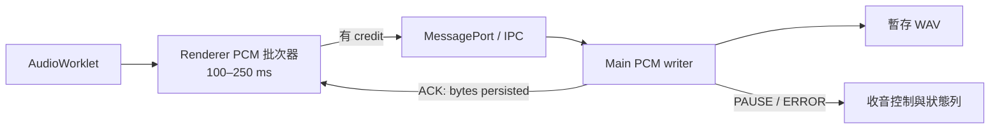
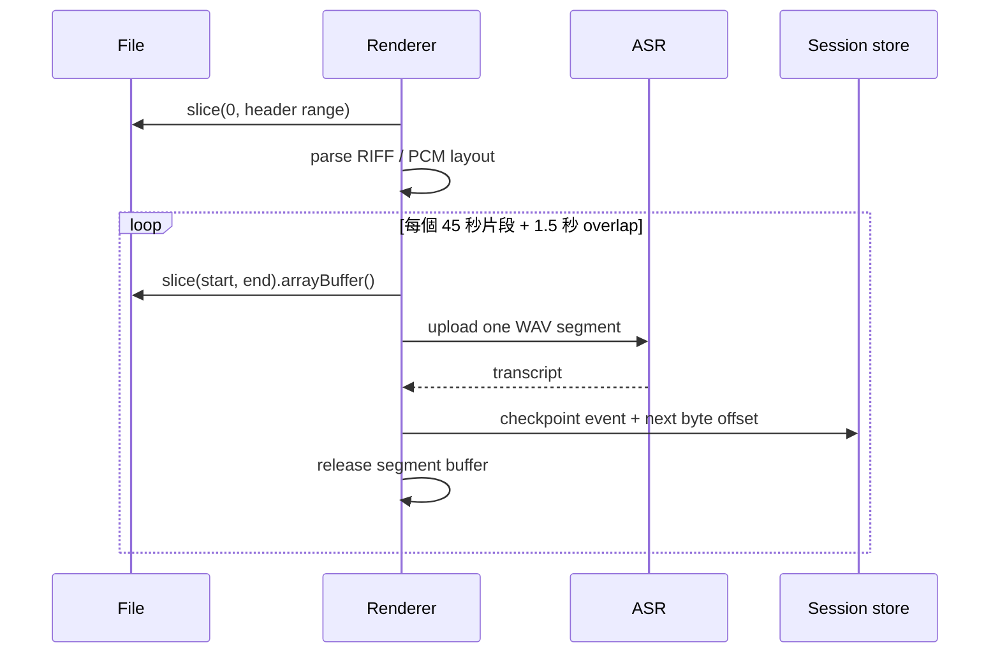

# 長時間即時字幕與大檔轉錄改善設計

本文件把 `TODO.md` 的 P0「長時間錄音與大檔轉錄可靠性」轉為可實作的設計。目標是讓 Electron 可穩定完成多小時錄音，Web 版能在受控儲存空間內運作，並讓長 WAV 的匯入記憶體使用量只與單一分段有關，而非整個檔案大小。

## 目標與非目標

### 目標

- Electron 收音 2 小時時，PCM 只存在於小型固定緩衝與暫存 WAV，不因時間持續增加 renderer 記憶體。
- Web 收音 2 小時時，音訊與逐字稿逐段寫入持久儲存；UI 只保留可見範圍和最近字幕。
- 匯入 PCM16 WAV 時，一次只讀取一個 ASR 分段和重疊範圍；取消能中止當前網路請求，失敗後可續跑。
- ASR、翻譯與摘要各自有有界佇列和限流，不讓附屬功能造成 ASR 字幕遺失。
- 每項完成後都有可重現的壓測資料、指標和失敗條件。

### 非目標

- 不在 renderer 內嵌 FFmpeg 或完整語音模型。
- 不把 HTTP 分段 ASR 偽裝為原生 partial transcript。
- 不為了維持即時字幕而靜默丟棄 WAV 音訊；無法落盤時必須停止收音並告知使用者。

## 現況與瓶頸

| 路徑 | 現況 | 風險 |
| --- | --- | --- |
| Electron 錄音 | AudioWorklet frame 經 IPC 送 Main，Main 串流寫 `.wav.part` | Renderer 不知道 Main 是否跟上；慢磁碟時 IPC 訊息與 Promise chain 可能累積。 |
| Web 錄音 | 每個 `Float32Array` 放入 `pcmChunksRef` | 48 kHz mono Float32 約 659 MiB/小時，停止時建 WAV 還會有一份 PCM16 副本。 |
| 即時字幕 | React state 持有所有 events，單筆更新會掃描並複製陣列 | 長會議的更新、搜尋、捲動和 localStorage 序列化時間會持續增加。 |
| 即時講者 preview | 每 15 秒從所有 PCM 重建 WAV | CPU、記憶體和上傳量隨錄音時間平方成長。 |
| WAV 匯入 | 整檔 `arrayBuffer()` 後建立所有 45 秒切片 | 大檔會同時保有原檔、切片與上傳複本，容易 OOM。 |
| 非 WAV Web 匯入 | UI 允許 100 MB，gateway 預設只收 12 MB，且固定標 WAV | 檔案大小、MIME、檔名與實際後端契約不一致。 |

## 第一階段：Electron 音訊寫入背壓

### 資料流



### 實作步驟

1. 在 renderer 新增 `PcmWriteController`，收集 AudioWorklet 的 128-sample frames，累積至 100–250 ms 後才送出。保留 sample offset 和 frame count，讓 WAV 時長可驗證。
2. 使用 `MessageChannelMain` / `MessagePortMain` 建立每次錄音專屬 channel；以 transferable `ArrayBuffer` 傳送 PCM，避免額外複製。若改動範圍需較小，可先保留 IPC，但仍需 ACK 與 credit。
3. Main writer 維護 `pendingBytes`，以 `WriteStream.write()` 結果與 `drain` 控制 ACK。每個 ACK 回傳已寫入 byte 數與可用 credit。
4. Renderer 最多保留 2 秒未確認 PCM。credit 歸零時停止從 Worklet 取新資料或暫停 capture；狀態顯示「磁碟寫入過慢，已暫停收音」，使用者可重試或停止。
5. `finish` 先等待所有 ACK、再寫 WAV header、最後回傳完整 sample count。任何 write error 使 session 進入明確 error 狀態，不能產生表面成功的錄音。

### 介面契約

```ts
type PcmBatch = { sequence: number; startSample: number; audio: ArrayBuffer }
type PcmAck = { sequence: number; persistedBytes: number; availableCreditBytes: number }
type PcmWriterState =
  | { type: 'ready'; availableCreditBytes: number }
  | { type: 'paused'; reason: 'disk-slow' }
  | { type: 'error'; message: string }
```

不要依訊息送達順序推斷落盤順序；以 `sequence` 驗證。Main 只接受嚴格遞增序號，重複或缺號應使 session 失敗並留下診斷資料。

## 第二階段：Web 分段持久化錄音

### 儲存模型

- `recordings` object store：`{ sessionId, chunkIndex, blob, startSample, endSample, mimeType }`。
- `sessions` object store：只保存 metadata、chunk count、duration、寫入狀態與 transcript cursor，不嵌完整音訊。
- 以 5–30 秒作為音訊 blob 大小；ASR 使用獨立的 2.4 秒／VAD 緩衝，不依賴已儲存 blob。
- 開始前呼叫 `navigator.storage.estimate()` 與 `navigator.storage.persist()`；預估空間不足時顯示可錄製時間或禁止開始。

### 實作步驟

1. 以 `MediaRecorder` 的 `dataavailable` 取得實際可播放的 WebM/Opus blobs，立即排入 IndexedDB 寫入，完成後釋放 Blob reference。
2. WAV 是匯出格式時，改由 server-side job 或逐段 PCM 寫入支援；不要在瀏覽器停止收音時把所有 Float32 合成 WAV。
3. 新增 IDB 寫入佇列和上限；IDB 寫慢時暫停 `MediaRecorder` 或停止 session，行為與 Electron 一致。
4. 讓播放以 chunk URL 依序播放，或在使用者選擇 WAV 匯出時建立非同步轉換 job；不要一次載入完整音檔。
5. Live diarization 預設關閉。若要保留，僅傳最近固定 30–60 秒窗口；停止後才對完整音檔執行最終講者分離。

### 相容性

OPFS 可作為 Chromium 的優先方案，IndexedDB blob 作為 fallback。兩者皆不可用或使用者拒絕持久儲存時，UI 必須限制為短暫預覽模式並清楚標記不會保存完整錄音。

## 第三階段：逐字稿與翻譯的有界資料模型

### Schema

```ts
type StoredTranscriptEvent = TranscriptEvent & {
  sessionId: string
  order: number
  updatedAt: number
}

// IndexedDB key: [sessionId, order]
// Secondary index: [sessionId, startMs]
```

### 實作步驟

1. `receiveTranscript` 先 append／update IndexedDB，再把最近 200–500 筆投影到 React state。
2. 字幕視窗採虛擬列表；搜尋走 IndexedDB cursor 或建立全文索引，不掃描已卸載的全部 state。
3. 翻譯佇列設最大 pending 數（例如 10）；滿載時先保留原文，翻譯在 ASR 壓力下降後補做。翻譯失敗只能標記該 event，不可阻塞錄音。
4. server 對 `/api/transcriptions`、`/api/translations`、`/api/summaries` 分別限流與併發控制。ASR 保留較高優先級；429 回應包含 `Retry-After`。
5. session 結束時寫入 completion marker；重開時依 marker 恢復。歷史頁、CSV 匯出與摘要從持久 store 分頁讀取。

### UI 行為

「清除即時字幕」只更新 `displayFromOrder`，不刪除持久 transcript；歷史與匯出仍能讀到完整資料。這保留既有產品需求，同時避免在記憶體維持被清除的畫面資料。

## 第四階段：長 WAV 的逐片匯入與續跑

### 分段讀取流程



### 實作步驟

1. 將 `wav-batch.ts` 拆成 `readPcmWavLayout(header)` 與 `createWavSegment(file, layout, startByte, endByte)`；後者只對單一 `File.slice()` 呼叫 `arrayBuffer()`。
2. 匯入 session 保存：原檔 fingerprint（檔名、size、lastModified、前後 header hash）、next byte offset、已完成 segments、合併後文字和設定快照。
3. 每個 HTTP request 都帶 `AbortSignal`；取消按鈕立即 `abort()`，等待當前 request 清理後保持 checkpoint。
4. 再次選到相同 fingerprint 時提示「從第 N 段繼續」；任何 ASR model、語言、prompt 變更都要求建立新 job，避免混合結果。
5. segment 上限由模型能力設定決定，並檢查 `audio.byteLength <= maxPayloadBytes`。預設不依賴 100 MB 魔術數字。

### 音訊品質

重疊文字合併應保留目前 suffix/prefix 去重作為第一版，但要記錄每段原始 ASR 結果與合併決策。日後可改成時間戳、token 或 word-level alignment；未取得模型 timestamps 前，不可宣稱精準時間對齊。

## 第五階段：非 WAV 匯入服務契約

### 短期修正

- 統一 UI、Renderer、Main、gateway 的 `maxPayloadBytes`；若 gateway 是 12 MB，就先在選檔時拒絕超限檔，不應顯示 100 MB 可用。
- Renderer 傳送原始 `filename`、經 allowlist 驗證的 `contentType`；gateway 使用相同名稱與 MIME 呼叫 OpenAI client。
- gateway 對超限回傳 413，並附帶可理解的最大值與 WAV 分段建議。

### 長期架構

非 WAV／影片大檔交給 server job：上傳串流至隔離暫存目錄、以受控 worker 轉為 PCM16 WAV、依進度回報 job status、支援 cancel、TTL 清理與磁碟配額。Renderer 只輪詢或接收 SSE 進度，不保存整檔。轉碼器、檔案格式白名單、資源限制與清理必須在 server 端完成。

## 壓力測試與效能預算

### 測試矩陣

| 場景 | 成功條件 |
| --- | --- |
| Electron 10 分鐘、慢磁碟 | 不漏 WAV samples；背壓可見且可恢復。 |
| Electron 2 小時 | Renderer heap、Main RSS 與未確認 PCM 維持固定上限。 |
| Web 2 小時 | 持久音訊分段完整；heap 不與時長線性上升。 |
| 2 小時 PCM16 WAV 匯入 | 峰值 heap 只與單段相關；可取消、可續跑。 |
| 20–100 MB MP3/M4A | MIME、大小限制、錯誤與後端實際契約一致。 |
| ASR 慢於即時／5xx | bounded queue、gap 記錄正確；翻譯不妨礙後續 ASR。 |
| 睡眠、斷網、切換音源、強制關閉 | session 可恢復或明確標為不可恢復。 |

### 每分鐘記錄的指標

- renderer heap、Main RSS、持久儲存用量。
- 未落盤 PCM bytes、IPC credit、ASR queue depth、translation queue depth。
- ASR request latency P50/P95、字幕端到端延遲、HTTP status、gap 數與原因。
- CPU 使用率與 event-loop delay。

先建立 5–10 分鐘的自動化 fixture 測試做 CI gate；2 小時 soak 測試放進 release checklist。任何 heap、RSS、queue depth 隨錄音時長穩定上升，都視為 release blocker。

## 建議交付順序

1. 修正非 WAV MIME／大小契約與建立壓測量測，先消除已知失敗路徑。
2. 完成 Electron PCM 背壓，因為桌面版是長時間錄音的主要路徑。
3. 將 transcript 改為 append-only store 與虛擬列表，解除長會議 UI 壓力。
4. 實作逐片 WAV 匯入、取消與續跑。
5. 實作 Web 持久化錄音與受控非 WAV server job。

每個階段合併前都需跑對應壓測，並把實測數據記入 `docs/VALIDATION.zh-TW.md`。
